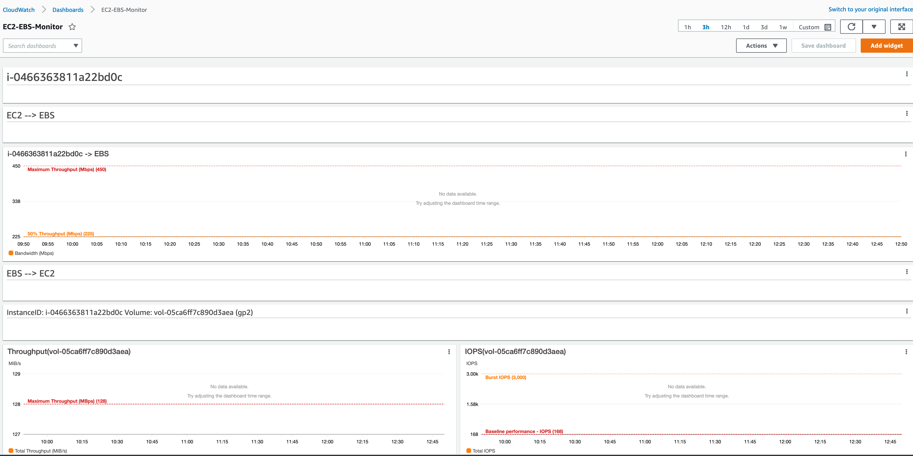

# EC2-> EBS auto cloudwatch dashboard

This code will help you create CloudWatch Dashboard to monitor the EBS performances and the Instance network performance.

To use this script change the Region and Instance list as following:
```
Region = "us-east-1" #Change this to the right region
InstanceList = ["i-0466363811a22bd0c"] # Change this to the list of instances you want to create the dashboard
```

Here is an example of the output



# How to run the script with Python virtual Environment 

```
python3 -m venv env 
source env/bin/activate
pip install requirements.txt
python3 script.py
```

You will need to make sure you have access key and secret key configured on the machine see [Link](https://docs.aws.amazon.com/IAM/latest/UserGuide/id_credentials_access-keys.html) 